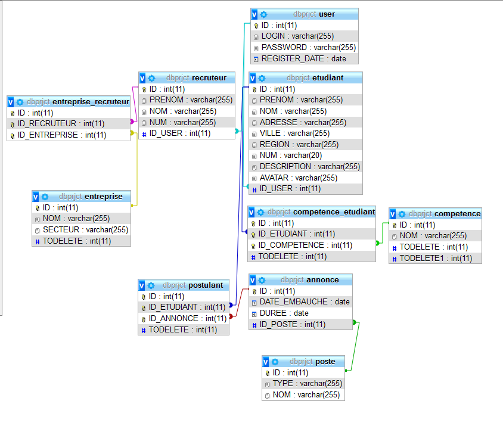

# NAMELESS


## NOTE D'INTENTION

Le but du projet est de créer une plateforme de mise en relation entre étudiants ( actuels ou récemment diplômés ) et recruteurs.
Les étudiants doivent pouvoir rentrer toutes leurs informations pour créer leur profil / générer dynamiquement leur CV et passer des annonces pour rechercher un emploi ( que ce soit un stage, un CDD, CDI, etc... ).
Les recruteurs doivent pouvoir parcourir les profils des étudiants en les filtrant par compétences, par zone géographique, etc...
Ils doivent également pouvoir passer des annonces pour proposer des postes à pourvoir.

## CONCEPT / ANGLE ET POINT DE VUE


## OBJECTIFS

Développer/Améliorer des compétences en développement web.

## CIBLES:

Les cibles sont des étudiants, des RH, des recruteurs.
  
  ### PERSONAS 
  
   
   
    - Sam, étudiant en droit
      - Informations de base :
          - Age : 20 ans
          - Situation familiale : Célibataire, sans enfant
          - Centres d'interêt : Réseaux sociaux, jeux vidéos, pizza, courses de voitures
          - vit en France dans une zone résidentielle
          - Traits de caractère : Accent du sud
          - Relation à la technologie : 10/10 => Addicted
          - Il porte des adidas Vegan parce que c'est à la mode
      - Objectifs :
          - Trouver une alternance pour sa première année
      - FREINS
        - Peu habitué aux sites communautaires


   
   
    - Virginie, étudiante en droit
      - Informations de base :
        - Age : 21 ans
        - Situation familiale : Célibataire, sans enfant
        - Centres d'interêt : Réseaux sociaux, Design, Relations sociales
        - Vit en France dans une collocation
        - Traits de caractère : Inquiète du regard des gens
        - Relation à la technologie : 9/10 Très accroc
        - Aime la mode, prendre ses plats en photos
      - Objectifs :
        - Trouver un stage pour la fin de son master
        
## Fonctionnalités 

- Se connecter sur la plateforme
- S'inscrire sur la plateforme
- Se renseignter sur la plateforme
- Choisir son status ( étudiant / recruteur )
- Renseigner ses informations personneles et de contact
- Renseigner son CV
- Voir les utilisateurs inscrits
- Mettre son profil en privé
- Rechercher un profil en particulier par nom / age / pays / ville / Etablissement / Niveau d'étude / Compétences
- Contacter un utilisateur via les informations fournies
- Partager le profil d'un utilisateurs sur les réseaux sociaux
- Poster une annonce de recherche de stage / alternance / poste
- Poster une annonce de recherche d'un profil particulier
- //TODO


## Etude de faisabilité

   ### Help trouver un title
   
   Le projet est un site web dynamique à réaliser, avec une base de données à modéliser, des interfaces ergonomiques à concevoir et un backend efficace.
   
   ### Analyse de la concurrence
   
   LinkedIn est la plateforme qui se rapproche le plus de l'idée globale, étant une usine à gaz, une inspiration des fonctionnalités de base est à envisager.
   
   ### Qualification de la cible
   
   Le projet répond à certains besoins urgents que les étudiants ont de trouver rapidement un stage pour la poursuite de leurs études et inversement aux recruteurs d'avoir une plateforme où trouver rapidement des profils interessants qui répondent aux besoin des entreprises.
   
   ### Niveau de sous-traitance du projet
   
   Le premier prototype du projet sera réalisé quasi entièrement par l'équipe de développement, l'utilisation de templates gratuits pour les interfaces est à envisager pour accélérer le développement.
   Dans un deuxième jet, l'utilisation d'un Framework est à envisager également dans un bût de performances et de modularité d'éventuelles nouvelles fonctionnalités.
   
   
   ### Le budget prévisionnel
   
   Café
   
   
   
   
## Analyse et conception
 
 ### Entitées
 
 Un premier jet d'analyse permet de ressortir les entitées non exhaustives importantes à noter :
   
- [USER] => Le compte de l'utilisateur inscrit sur la plateforme
- [ETUDIANT] => la spécialisétion de l'utilisateur sur la plateforme
- [RECRUTEUR] => la spécialisétion bis de l'utilisateur sur la plateforme
- [ENTREPRISE] => Une entreprise
- [ASSOCIATION_ENTREPRISE_RECRUTEUR] => Une entreprise représentée par un recruteur ( un recruteur peut représenter plusieurs entreprises )
- [ANNONCE] => Une annonce postée sur la plateforme 
- [COMPETENCES] => Une compétence
- [ASSOCIATION_COMPETENCE_UTILISATEUR] => Une compétence choisie par un étudiant  ( un étudiant peur avoir plusieurs compétences )
- [POSTE] => un type de poste


### Premier jet de modèle conception des données

  


### Script de génération de la base de données

```SQL
-- phpMyAdmin SQL Dump
-- version 4.7.4
-- https://www.phpmyadmin.net/
--
-- Hôte : 127.0.0.1
-- Généré le :  jeu. 07 mars 2019 à 23:07
-- Version du serveur :  10.1.29-MariaDB
-- Version de PHP :  7.2.0

SET SQL_MODE = "NO_AUTO_VALUE_ON_ZERO";
SET AUTOCOMMIT = 0;
START TRANSACTION;
SET time_zone = "+00:00";


/*!40101 SET @OLD_CHARACTER_SET_CLIENT=@@CHARACTER_SET_CLIENT */;
/*!40101 SET @OLD_CHARACTER_SET_RESULTS=@@CHARACTER_SET_RESULTS */;
/*!40101 SET @OLD_COLLATION_CONNECTION=@@COLLATION_CONNECTION */;
/*!40101 SET NAMES utf8mb4 */;

--
-- Base de données :  `dbprjct`
--

-- --------------------------------------------------------

--
-- Structure de la table `annonce`
--

CREATE TABLE `annonce` (
  `ID` int(11) NOT NULL,
  `DATE_EMBAUCHE` date NOT NULL,
  `DUREE` date NOT NULL,
  `ID_POSTE` int(11) NOT NULL
) ENGINE=InnoDB DEFAULT CHARSET=latin1;

-- --------------------------------------------------------

--
-- Structure de la table `competence`
--

CREATE TABLE `competence` (
  `ID` int(11) NOT NULL,
  `NOM` varchar(255) NOT NULL
) ENGINE=InnoDB DEFAULT CHARSET=latin1;

-- --------------------------------------------------------

--
-- Structure de la table `competence_etudiant`
--

CREATE TABLE `competence_etudiant` (
  `ID` int(11) NOT NULL,
  `ID_ETUDIANT` int(11) NOT NULL,
  `ID_COMPETENCE` int(11) NOT NULL
) ENGINE=InnoDB DEFAULT CHARSET=latin1;

-- --------------------------------------------------------

--
-- Structure de la table `entreprise`
--

CREATE TABLE `entreprise` (
  `ID` int(11) NOT NULL,
  `NOM` varchar(255) NOT NULL,
  `SECTEUR` varchar(255) DEFAULT NULL
) ENGINE=InnoDB DEFAULT CHARSET=latin1;

-- --------------------------------------------------------

--
-- Structure de la table `entreprise_recruteur`
--

CREATE TABLE `entreprise_recruteur` (
  `ID` int(11) NOT NULL,
  `ID_RECRUTEUR` int(11) NOT NULL,
  `ID_ENTREPRISE` int(11) NOT NULL
) ENGINE=InnoDB DEFAULT CHARSET=latin1;

-- --------------------------------------------------------

--
-- Structure de la table `etudiant`
--

CREATE TABLE `etudiant` (
  `ID` int(11) NOT NULL,
  `PRENOM` varchar(255) NOT NULL,
  `NOM` varchar(255) NOT NULL,
  `ADRESSE` varchar(255) NOT NULL,
  `VILLE` varchar(255) NOT NULL,
  `REGION` varchar(255) NOT NULL,
  `NUM` varchar(20) NOT NULL,
  `DESCRIPTION` varchar(255) DEFAULT NULL,
  `AVATAR` varchar(255) DEFAULT NULL,
  `ID_USER` int(11) NOT NULL
) ENGINE=InnoDB DEFAULT CHARSET=latin1;

-- --------------------------------------------------------

--
-- Structure de la table `poste`
--

CREATE TABLE `poste` (
  `ID` int(11) NOT NULL,
  `TYPE` varchar(255) NOT NULL,
  `NOM` varchar(255) NOT NULL
) ENGINE=InnoDB DEFAULT CHARSET=latin1;

-- --------------------------------------------------------

--
-- Structure de la table `postulant`
--

CREATE TABLE `postulant` (
  `ID` int(11) NOT NULL,
  `ID_ETUDIANT` int(11) NOT NULL,
  `ID_ANNONCE` int(11) NOT NULL
) ENGINE=InnoDB DEFAULT CHARSET=latin1;

-- --------------------------------------------------------

--
-- Structure de la table `recruteur`
--

CREATE TABLE `recruteur` (
  `ID` int(11) NOT NULL,
  `PRENOM` varchar(255) NOT NULL,
  `NOM` varchar(255) NOT NULL,
  `NUM` varchar(255) NOT NULL,
  `ID_USER` int(11) NOT NULL
) ENGINE=InnoDB DEFAULT CHARSET=latin1;

-- --------------------------------------------------------

--
-- Structure de la table `user`
--

CREATE TABLE `user` (
  `ID` int(11) NOT NULL,
  `LOGIN` varchar(255) NOT NULL,
  `PASSWORD` varchar(255) NOT NULL,
  `REGISTER_DATE` date NOT NULL
) ENGINE=InnoDB DEFAULT CHARSET=latin1;

--
-- Déchargement des données de la table `user`
--

INSERT INTO `user` (`ID`, `LOGIN`, `PASSWORD`, `REGISTER_DATE`) VALUES
(1, 'bhaily0@alexa.com', 'XCjgxv476Mp', '0000-00-00'),
(2, 'rschenfisch1@ihg.com', '4CbT072', '0000-00-00'),
(3, 'ssimoni2@bloglines.com', 'KrHdoWhYJB', '0000-00-00'),
(4, 'lhankey3@sina.com.cn', 'Hr2xkNU', '0000-00-00'),
(5, 'bmulrean4@jalbum.net', 'Dzl4LRY8LLIV', '0000-00-00'),
(6, 'ewitherspoon5@sakura.ne.jp', 'MvR4JS7nKSLq', '0000-00-00'),
(7, 'hterry6@google.com', 'OiK1qx3fWxbh', '0000-00-00'),
(8, 'mcawkill7@phpbb.com', 'XlCPffTVVghP', '0000-00-00'),
(9, 'tteggin8@thetimes.co.uk', 'RkD99D', '0000-00-00'),
(10, 'atufts9@cnn.com', '9AUEvWjPYr', '0000-00-00'),
(11, 'cosgardbya@bloomberg.com', 'KmQWJd6', '0000-00-00'),
(12, 'dgrumbridgeb@reddit.com', '7wHL2rwlr2', '0000-00-00'),
(13, 'rburgisic@desdev.cn', 'WEu2q9BWc4p', '0000-00-00'),
(14, 'mbehnend@nationalgeographic.com', 'yguWyL9ih44b', '0000-00-00'),
(15, 'pizarde@reddit.com', 'sia08VZ', '0000-00-00'),
(16, 'mlevisonf@rakuten.co.jp', 'ISDeGtKnSR', '0000-00-00'),
(17, 'rmcliceg@xrea.com', 'GrFWxSMbt', '0000-00-00'),
(18, 'vperelh@walmart.com', '49LFgx', '0000-00-00'),
(19, 'tcastagnerii@addthis.com', 'szJlPSr', '0000-00-00'),
(20, 'jwestcotj@multiply.com', 'PosTFybL4Jp', '0000-00-00'),
(21, 'tkulisk@hexun.com', 'j5Y3auibz6K', '0000-00-00'),
(22, 'rkrishtopaittisl@samsung.com', 'GnGx6kYjk', '0000-00-00'),
(23, 'eyukhnevm@squidoo.com', 'dTyJlEDNR', '0000-00-00'),
(24, 'dbaumn@google.de', 'UC3XPX', '0000-00-00'),
(25, 'udespensero@unc.edu', 'NX7OGKea1K3x', '0000-00-00'),
(26, 'bioannidisp@multiply.com', 'cuN4imsmlU', '0000-00-00'),
(27, 'mjavesq@foxnews.com', 'IfNUa0Xj', '0000-00-00'),
(28, 'abooelnr@ebay.co.uk', 'YHpr1wU', '0000-00-00'),
(29, 'lrisdales@godaddy.com', '7J0mHaM9duEB', '0000-00-00'),
(30, 'eroughsedget@biblegateway.com', 'DhogJgn1emP', '0000-00-00'),
(31, 'bocarrolu@umich.edu', 'k4I4Ppt9bwp8', '0000-00-00'),
(32, 'dcowderayv@uol.com.br', 'LTK4DPoV', '0000-00-00'),
(33, 'ahardcastlew@senate.gov', 'h4ZLKax', '0000-00-00'),
(34, 'dweinbergx@cpanel.net', 'yq0voUXs23', '0000-00-00'),
(35, 'tsowrahy@adobe.com', 'AY5XyJG', '0000-00-00'),
(36, 'ahuleattz@blog.com', 'bugY52OvRv', '0000-00-00'),
(37, 'jnavaro10@usatoday.com', 'QVkSmeJ', '0000-00-00'),
(38, 'hgrichukhanov11@fda.gov', 'ficxeoPE', '0000-00-00'),
(39, 'dmucci12@lycos.com', 'b393rmSsnz89', '0000-00-00'),
(40, 'ftreagus13@addtoany.com', 'iqghFR9re0J', '0000-00-00');

--
-- Index pour les tables déchargées
--

--
-- Index pour la table `annonce`
--
ALTER TABLE `annonce`
  ADD PRIMARY KEY (`ID`),
  ADD KEY `fk_annonce_poste` (`ID_POSTE`);

--
-- Index pour la table `competence`
--
ALTER TABLE `competence`
  ADD PRIMARY KEY (`ID`);

--
-- Index pour la table `competence_etudiant`
--
ALTER TABLE `competence_etudiant`
  ADD PRIMARY KEY (`ID`,`ID_ETUDIANT`,`ID_COMPETENCE`),
  ADD KEY `fk_comp_etu_etu` (`ID_ETUDIANT`),
  ADD KEY `fk_comp_etu_comp` (`ID_COMPETENCE`);

--
-- Index pour la table `entreprise`
--
ALTER TABLE `entreprise`
  ADD PRIMARY KEY (`ID`);

--
-- Index pour la table `entreprise_recruteur`
--
ALTER TABLE `entreprise_recruteur`
  ADD PRIMARY KEY (`ID`,`ID_RECRUTEUR`,`ID_ENTREPRISE`),
  ADD KEY `fk_ent_rec_rec` (`ID_RECRUTEUR`),
  ADD KEY `fk_ent_rec_ent` (`ID_ENTREPRISE`);

--
-- Index pour la table `etudiant`
--
ALTER TABLE `etudiant`
  ADD PRIMARY KEY (`ID`),
  ADD KEY `fk_ETUDIANT_USER_ID_USER` (`ID_USER`);

--
-- Index pour la table `poste`
--
ALTER TABLE `poste`
  ADD PRIMARY KEY (`ID`);

--
-- Index pour la table `postulant`
--
ALTER TABLE `postulant`
  ADD PRIMARY KEY (`ID`,`ID_ETUDIANT`,`ID_ANNONCE`),
  ADD KEY `fk_postulant_etudiant` (`ID_ETUDIANT`),
  ADD KEY `fk_postulant_annonce` (`ID_ANNONCE`);

--
-- Index pour la table `recruteur`
--
ALTER TABLE `recruteur`
  ADD PRIMARY KEY (`ID`),
  ADD KEY `fk_RECRUTEUR_USER_ID_USER` (`ID_USER`);

--
-- Index pour la table `user`
--
ALTER TABLE `user`
  ADD PRIMARY KEY (`ID`);

--
-- AUTO_INCREMENT pour les tables déchargées
--

--
-- AUTO_INCREMENT pour la table `etudiant`
--
ALTER TABLE `etudiant`
  MODIFY `ID` int(11) NOT NULL AUTO_INCREMENT, AUTO_INCREMENT=2;

--
-- AUTO_INCREMENT pour la table `recruteur`
--
ALTER TABLE `recruteur`
  MODIFY `ID` int(11) NOT NULL AUTO_INCREMENT;

--
-- AUTO_INCREMENT pour la table `user`
--
ALTER TABLE `user`
  MODIFY `ID` int(11) NOT NULL AUTO_INCREMENT, AUTO_INCREMENT=41;

--
-- Contraintes pour les tables déchargées
--

--
-- Contraintes pour la table `annonce`
--
ALTER TABLE `annonce`
  ADD CONSTRAINT `fk_annonce_poste` FOREIGN KEY (`ID_POSTE`) REFERENCES `poste` (`ID`);

--
-- Contraintes pour la table `competence_etudiant`
--
ALTER TABLE `competence_etudiant`
  ADD CONSTRAINT `fk_comp_etu_comp` FOREIGN KEY (`ID_COMPETENCE`) REFERENCES `competence` (`ID`),
  ADD CONSTRAINT `fk_comp_etu_etu` FOREIGN KEY (`ID_ETUDIANT`) REFERENCES `etudiant` (`ID`);

--
-- Contraintes pour la table `entreprise_recruteur`
--
ALTER TABLE `entreprise_recruteur`
  ADD CONSTRAINT `fk_ent_rec_ent` FOREIGN KEY (`ID_ENTREPRISE`) REFERENCES `entreprise` (`ID`),
  ADD CONSTRAINT `fk_ent_rec_rec` FOREIGN KEY (`ID_RECRUTEUR`) REFERENCES `recruteur` (`ID`);

--
-- Contraintes pour la table `etudiant`
--
ALTER TABLE `etudiant`
  ADD CONSTRAINT `fk_ETUDIANT_USER_ID_USER` FOREIGN KEY (`ID_USER`) REFERENCES `user` (`ID`);

--
-- Contraintes pour la table `postulant`
--
ALTER TABLE `postulant`
  ADD CONSTRAINT `fk_postulant_annonce` FOREIGN KEY (`ID_ANNONCE`) REFERENCES `annonce` (`ID`),
  ADD CONSTRAINT `fk_postulant_etudiant` FOREIGN KEY (`ID_ETUDIANT`) REFERENCES `etudiant` (`ID`);

--
-- Contraintes pour la table `recruteur`
--
ALTER TABLE `recruteur`
  ADD CONSTRAINT `fk_RECRUTEUR_USER_ID_USER` FOREIGN KEY (`ID_USER`) REFERENCES `user` (`ID`);
COMMIT;

/*!40101 SET CHARACTER_SET_CLIENT=@OLD_CHARACTER_SET_CLIENT */;
/*!40101 SET CHARACTER_SET_RESULTS=@OLD_CHARACTER_SET_RESULTS */;
/*!40101 SET COLLATION_CONNECTION=@OLD_COLLATION_CONNECTION */;


```

   


